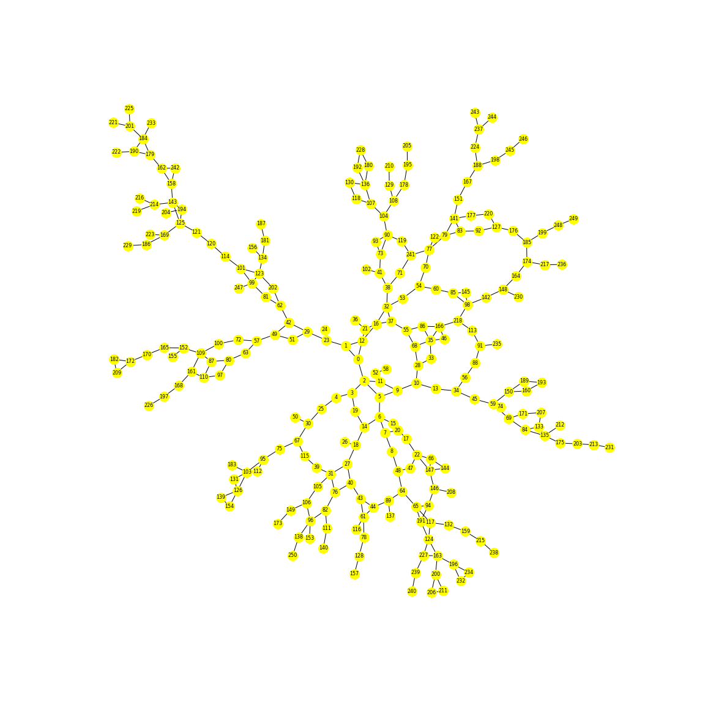
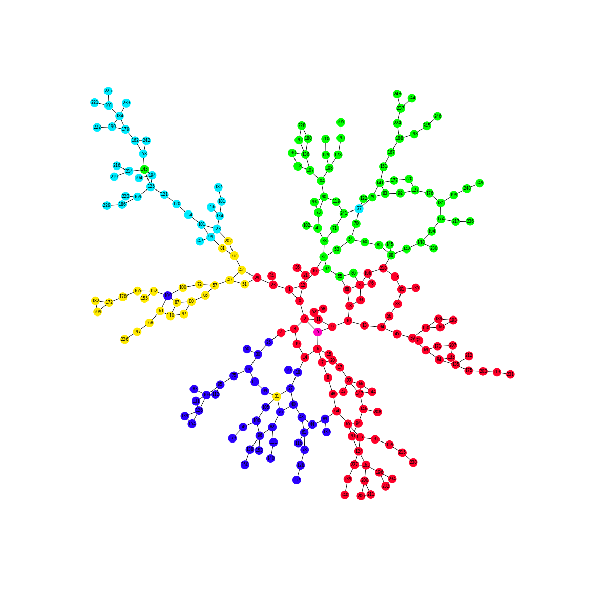

# GMCA
 
This implementation shows how optimization techniques can be used to locate ambulances, rapid response teams, and even food delivery points.

## Stack
- [networkx](https://networkx.org/)

## Setup

Clone the repository and change the working directory:

    git clone https://github.com/SvNext/GMCA.git
    cd GMCA
Create and activate the virtual environment:

    python3 -m venv env
    source env/bin/activate
Install requirements:

    pip install -r requirements.txt

Run the jupyter notebook:

    jupyter notebook main.ipynb
    
    
## Results

The results include a table with numerical values and a graphical arrangement of the medoids and the corresponding clusters.
A schematic description of the algorithm is given in the presentation

